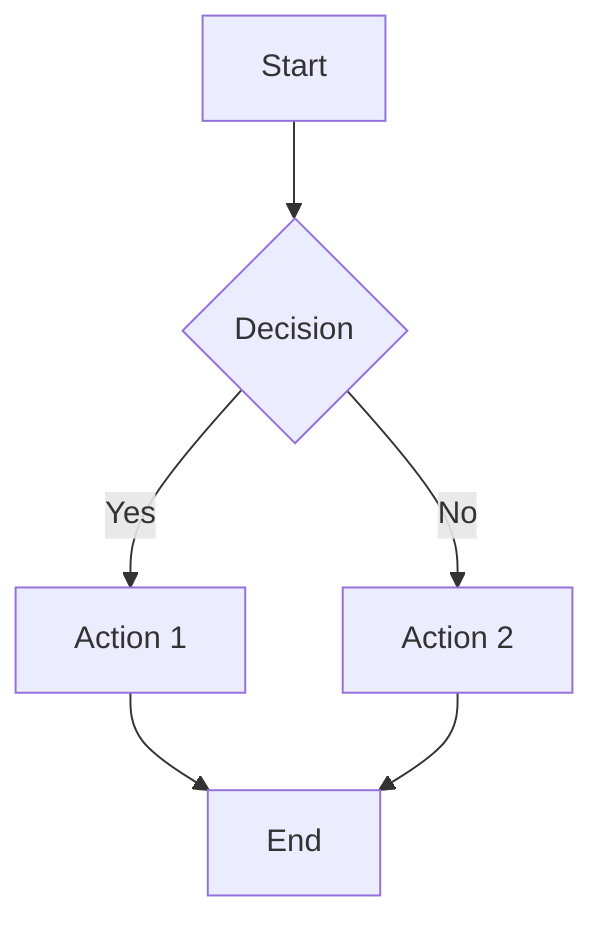

# Hugo + Quarto Documentation System

A modern documentation system that combines Hugo's fast static site generation with Quarto's powerful document processing capabilities.

## ✨ Features

- 🚀 **Fast Performance**: Hugo's lightning-fast static site generation
- 📄 **Rich Documents**: Write in Markdown/Quarto with export to DOCX/PPTX
- 🎨 **Beautiful Theme**: Responsive design with hierarchical navigation
- 🔍 **Smart Navigation**: Expandable/collapsible folder structure
- 🖨️ **Print-Friendly**: Clean printing with content-only view
- 📊 **Diagram Support**: Mermaid diagrams and mathematical expressions
- 💬 **Collaboration**: Inline comments and version control
- 📱 **Mobile Ready**: Full-screen mobile navigation for easy access

## 🚀 Installation Options

### 🎯 One-Click Installation & Updates (EASIEST!)

**Copy this line, paste in Terminal, press Enter:**

```bash
curl -sSL https://raw.githubusercontent.com/accionlabs/hugo-quarto-docs/main/web-install.sh | bash
```

**That's it!** The smart installer will:
- ✅ **Detect existing installations** and offer to update them
- ✅ **Create new installations** when none exist
- ✅ **Set up everything automatically** (no downloads, no renaming)
- ✅ **Create desktop shortcuts** you can double-click
- ✅ **Put documents in Documents/Documentation System** (easy to find)
- ✅ **Guide you through the entire process** step-by-step
- ✅ **Work without any technical knowledge**

### 🖱️ Alternative: Download Method

If you prefer to download first:

1. **[Download Installer](https://raw.githubusercontent.com/accionlabs/hugo-quarto-docs/main/gui-install.sh)** (Right-click → Save Link As)
2. **Rename** to `Easy Installer.command`
3. **Double-click** to run

### 💻 For Developers

```bash
curl -sSL https://accionlabs.github.io/hugo-quarto-docs/install.sh | bash
```

## 📁 Finding Your Documents After Installation

### Non-Technical Installation:
- **Location**: `Documents/my-documentation/content/`
- **Quick access**: Double-click "Open Content Folder.command"

### Technical Installation:
- **Location**: `~/hugo-quarto-docs/content/`
- **Command**: Navigate with `cd ~/hugo-quarto-docs`
- **Start system**: `./launch.sh` or `hugo serve`
- **View site**: Open `http://localhost:1313`

### 🗂️ Folder Structure:
```
content/
├── private/          # Your personal notes (not shared)
├── projects/         # Client work and project documents  
├── shared/          # Team knowledge base and resources
└── assets/          # Images, files, and exports
```

**💡 Pro tip**: Bookmark the content folder in Finder for easy access!

## 🔄 Staying Updated

**Get the latest features and improvements:**

For existing installations, simply run the same web installer command:

```bash
curl -sSL https://raw.githubusercontent.com/accionlabs/hugo-quarto-docs/main/web-install.sh | bash
```

**✨ Smart Update System:**
- ✅ **Automatically detects** existing installations
- ✅ **Offers update option** with easy selection
- ✅ **Creates automatic backups** before any changes
- ✅ **Preserves all your content** and settings
- ✅ **Safe rollback** capability built-in
- ✅ **No technical knowledge required**

Your content is always protected during updates!

## 🛠️ Manual Installation (Advanced Users)

### Prerequisites

- [Hugo](https://gohugo.io/installation/) (v0.115.0+)
- [Quarto](https://quarto.org/docs/get-started/) (v1.3.0+)
- [Pandoc](https://pandoc.org/installing.html) (optional but recommended for better table conversion)

### Manual Setup

1. **Clone the repository**:
```bash
git clone https://github.com/accionlabs/hugo-quarto-docs.git
cd hugo-quarto-docs
```

2. **Set up your content**:
```bash
# Copy sample content to get started
cp -r content-sample/ content/

# Or create your own content structure
mkdir -p content/private content/projects content/shared
```

3. **Start the development server**:
```bash
hugo serve
```

4. **View your site** at `http://localhost:1313`

### Building Documents

To process Quarto documents and generate exports:

```bash
# Build all Quarto documents and generate exports
./build.sh

# Build site only (without Quarto processing)
hugo
```

## 📁 Project Structure

```
hugo-quarto-docs/
├── content/                 # Your documentation content
│   ├── private/            # Personal/confidential content
│   ├── projects/           # Project documentation
│   └── shared/             # Team knowledge base
├── content-sample/         # Sample content (copy to content/)
├── themes/stag-theme/      # Custom Hugo theme
├── static/                 # Static assets (CSS, images)
├── build.sh               # Quarto + Hugo build script
├── hugo.yaml              # Hugo configuration
└── README.md              # This file
```

## 📝 Writing Content

### Basic Markdown

Create `.md` files for standard documentation:

```markdown
---
title: "Document Title"
description: "Brief description"
---

# Your Content Here

Regular markdown content for web-only documentation.
```

### Quarto Documents

Create `.qmd` files for rich documents with export capabilities:

```markdown
---
title: "Rich Document"
description: "Document with export options"
quarto_exports: ["docx", "pptx"]
---

# Rich Content

This document supports:
- Export to DOCX/PPTX
- Mermaid diagrams
- Mathematical equations
- Code blocks with syntax highlighting
```

### Diagrams

Use Mermaid for diagrams:

```markdown

```

### Comments

Add collaborative comments using shortcodes:

```markdown

Should we add more details about the implementation?

```

## ⚙️ Configuration

### Hugo Configuration

The `hugo.yaml` file contains the main configuration. Key settings:

```yaml
baseURL: 'https://your-domain.com'
title: 'Your Documentation System'
theme: 'stag-theme'

params:
  description: 'Your team documentation'
  author: 'Your Team'
```

### Content Organization

Each main section should have an `_index.md` file:

```markdown
---
title: "Section Name"
description: "Section description"
---

# Section Overview

Content for the section landing page.
```

## 🔧 Development

### Local Development

```bash
# Start development server with live reload
hugo serve

# Build site
hugo

# Process Quarto documents
./build.sh
```

### Theme Customization

The theme is located in `themes/stag-theme/`. Key files:

- `layouts/_default/baseof.html` - Base template
- `layouts/_default/single.html` - Single page template
- `layouts/_default/list.html` - List page template
- `static/css/main.css` - Main stylesheet

### Build Script

The `build.sh` script processes Quarto documents:

1. Finds all `.qmd` files
2. Renders them to markdown
3. Generates exports (DOCX/PPTX)
4. Copies exports to static directory
5. Builds the Hugo site

## 🎨 Theme Features

### Navigation

- **Hierarchical sidebar** with expand/collapse
- **Breadcrumb navigation** for deep content
- **Back navigation** icons for easy traversal
- **Search functionality** (if enabled)

### Content Features

- **Export buttons** for Quarto documents
- **Print-friendly** styles
- **Responsive design** for mobile
- **Syntax highlighting** for code blocks
- **Mathematical expressions** with KaTeX

### Layout

- **Clean, modern design**
- **Consistent typography**
- **Optimized for readability**
- **Print styles** that hide navigation

## 🚀 Deployment

### Static Hosting

Deploy to any static hosting service:

```bash
# Build the site
hugo

# Deploy the public/ directory to your hosting service
# Examples: Netlify, Vercel, GitHub Pages, S3, etc.
```

### GitHub Pages

1. Push to GitHub repository
2. Enable GitHub Pages in repository settings
3. Set source to "GitHub Actions"
4. Use the provided GitHub Action workflow

### Netlify

1. Connect repository to Netlify
2. Set build command: `hugo`
3. Set publish directory: `public`
4. Deploy

## 📚 Examples

See the `content-sample/` directory for examples of:

- Basic markdown pages
- Quarto documents with exports
- Project organization
- Comment usage
- Diagram integration

## 🤝 Contributing

1. Fork the repository
2. Create a feature branch
3. Make your changes
4. Test locally with `hugo serve`
5. Submit a pull request

## 📄 License

This project is licensed under the MIT License - see the [LICENSE](LICENSE) file for details.

## 🆘 Support

- **Issues**: Report bugs and feature requests on [GitHub Issues](https://github.com/your-username/hugo-quarto-docs/issues)
- **Documentation**: Check the [Hugo docs](https://gohugo.io/documentation/) and [Quarto docs](https://quarto.org/docs/)
- **Community**: Join the Hugo and Quarto communities for help

## 🙏 Acknowledgments

- [Hugo](https://gohugo.io/) - The world's fastest framework for building websites
- [Quarto](https://quarto.org/) - An open-source scientific and technical publishing system
- [Mermaid](https://mermaid.js.org/) - Generation of diagrams and flowcharts