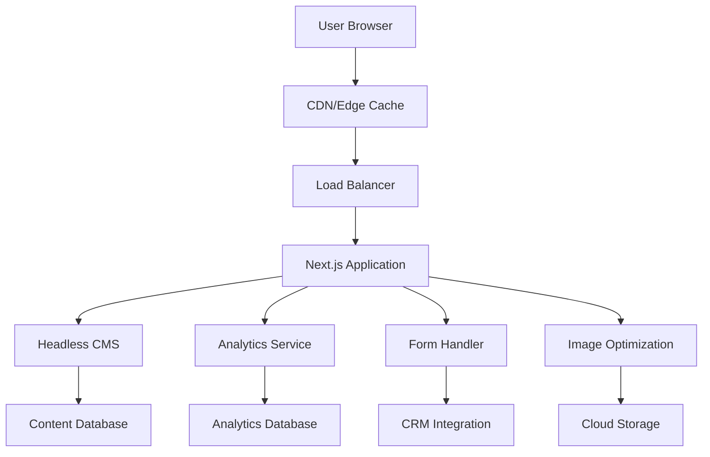

# Technical Specifications

*Technical Architecture for Acme Corporation Website Redesign*  
*Version 1.2 - February 8, 2025*

## Architecture Overview

### System Architecture



### Technology Stack

#### Frontend Framework
**Next.js 14** (React-based)
- **Rationale**: Server-side rendering for SEO, excellent performance
- **Features**: Static generation, API routes, image optimization  
- **Performance**: Built-in optimization, automatic code splitting

#### Content Management  
**Strapi Headless CMS**
- **Rationale**: Developer-friendly, flexible content structure
- **Features**: REST & GraphQL APIs, role-based permissions
- **Hosting**: Separate instance for security and scalability

#### Deployment & Hosting
**Vercel Platform**  
- **Rationale**: Optimized for Next.js, global CDN, zero-config
- **Features**: Automatic deployments, preview environments  
- **Performance**: Edge functions, automatic optimizations


Vercel provides excellent performance for React/Next.js applications with minimal configuration


## Performance Requirements

### Loading Performance Targets

#### Core Web Vitals
| Metric | Target | Current | Priority |
|--------|--------|---------|----------|
| Largest Contentful Paint (LCP) | <2.5s | 4.2s | Critical |
| First Input Delay (FID) | <100ms | 145ms | High |  
| Cumulative Layout Shift (CLS) | <0.1 | 0.15 | High |

#### Page Speed Targets
- **Desktop**: 95+ Google PageSpeed Score
- **Mobile**: 90+ Google PageSpeed Score  
- **Time to Interactive**: <3 seconds on 3G
- **First Meaningful Paint**: <1.5 seconds

### Performance Implementation Strategy

#### Image Optimization
- **Format**: WebP with fallback (JPEG/PNG)
- **Responsive images**: Multiple sizes for different viewports
- **Lazy loading**: Below-the-fold images  
- **Compression**: 80% quality maintained for photos
- **CDN delivery**: Global edge distribution

#### Code Optimization
- **Bundle splitting**: Automatic code splitting by route
- **Tree shaking**: Remove unused JavaScript
- **Minification**: CSS, JavaScript, and HTML
- **Compression**: Gzip/Brotli for text assets
- **Critical CSS**: Inline above-the-fold styles

#### Caching Strategy
- **Static assets**: 1-year cache headers
- **HTML pages**: 1-hour cache with revalidation
- **API responses**: Vary by content type and frequency
- **CDN edge caching**: Global content distribution

## Responsive Design Specifications

### Breakpoint Strategy

```css
/* Mobile First Approach */
/* Base styles: 320px+ */

@media (min-width: 640px) {  /* Small tablets */
  /* Tablet styles */
}

@media (min-width: 768px) {  /* Large tablets */
  /* Large tablet styles */  
}

@media (min-width: 1024px) { /* Desktop */
  /* Desktop styles */
}

@media (min-width: 1280px) { /* Large desktop */
  /* Large desktop styles */
}
```

### Grid System Implementation

#### CSS Grid Layout
- **Container**: `max-width: 1200px`
- **Columns**: 12-column grid system
- **Gutters**: 24px (desktop), 16px (mobile)
- **Margins**: 48px (desktop), 20px (mobile)

#### Component Responsiveness
- **Navigation**: Hamburger menu <768px
- **Images**: Responsive with `srcset` attributes
- **Typography**: Fluid scaling between breakpoints
- **Layout**: Stack to single column <640px

## Accessibility Implementation

### WCAG 2.1 AA Compliance

#### Color & Contrast
- **Text contrast**: Minimum 4.5:1 ratio
- **Large text contrast**: Minimum 3:1 ratio
- **Color independence**: Information not conveyed by color alone
- **Focus indicators**: Visible focus outlines (minimum 2px)

#### Keyboard Navigation
- **Tab order**: Logical navigation sequence
- **Focus management**: Proper focus handling in interactive elements
- **Keyboard shortcuts**: Skip links for main content
- **No keyboard traps**: Users can navigate out of all components

#### Screen Reader Support
- **Semantic HTML**: Proper heading hierarchy (H1→H2→H3)
- **ARIA labels**: Descriptive labels for interactive elements
- **Alt text**: Descriptive alt text for all images
- **Form labels**: Explicit labels for all form inputs

#### Implementation Checklist
- [ ] Automated accessibility testing (axe-core)
- [ ] Manual keyboard testing
- [ ] Screen reader testing (NVDA/VoiceOver)
- [ ] Color contrast validation  
- [ ] Focus management verification

## SEO Technical Requirements

### On-Page SEO

#### Meta Tags Implementation
```html
<!-- Primary meta tags -->
<title>Page Title | Acme Corporation</title>
<meta name="description" content="Page description">
<meta name="viewport" content="width=device-width, initial-scale=1">

<!-- Open Graph / Facebook -->  
<meta property="og:type" content="website">
<meta property="og:url" content="https://acme.com/page">
<meta property="og:title" content="Page Title">
<meta property="og:description" content="Page description">
<meta property="og:image" content="https://acme.com/og-image.jpg">

<!-- Twitter -->
<meta property="twitter:card" content="summary_large_image">
<meta property="twitter:url" content="https://acme.com/page">
<meta property="twitter:title" content="Page Title">
<meta property="twitter:description" content="Page description">
<meta property="twitter:image" content="https://acme.com/twitter-image.jpg">
```

#### Structured Data
- **Organization schema**: Company information
- **Service schema**: Service pages
- **Review schema**: Testimonials and reviews
- **FAQ schema**: Frequently asked questions
- **LocalBusiness schema**: Contact and location information

#### Technical SEO
- **XML sitemap**: Automatically generated
- **Robots.txt**: Proper crawling instructions  
- **Internal linking**: Strategic cross-page linking
- **URL structure**: Clean, descriptive URLs
- **Page speed**: Optimized for Core Web Vitals

## Security Requirements

### Application Security

#### HTTPS Implementation
- **SSL Certificate**: Wildcard certificate for all subdomains
- **HSTS headers**: Strict transport security enabled
- **Mixed content**: All resources served over HTTPS
- **Certificate monitoring**: Automatic renewal and alerts

#### Content Security Policy
```http
Content-Security-Policy: 
  default-src 'self';
  script-src 'self' 'unsafe-inline' analytics.google.com;
  style-src 'self' 'unsafe-inline' fonts.googleapis.com;
  font-src 'self' fonts.gstatic.com;
  img-src 'self' data: https:;
  connect-src 'self' analytics.google.com;
```

#### Form Security
- **Input validation**: Server-side validation for all inputs
- **CSRF protection**: Cross-site request forgery tokens
- **Rate limiting**: Prevent spam and abuse
- **Honeypot fields**: Bot detection on forms
- **Sanitization**: HTML/SQL injection prevention

### Data Privacy & GDPR

#### Cookie Management
- **Cookie consent**: Compliant consent banner
- **Cookie categories**: Essential, analytics, marketing
- **Cookie policy**: Clear cookie usage documentation
- **Opt-out mechanisms**: Easy consent withdrawal

#### Analytics Privacy
- **IP anonymization**: Google Analytics IP masking
- **Data retention**: Limited data retention periods
- **User controls**: Analytics opt-out options
- **Third-party auditing**: Regular privacy compliance review

## Integration Requirements

### CRM Integration (HubSpot)

#### Form Submissions
- **API endpoint**: `/api/forms/contact`
- **Data mapping**: Form fields to HubSpot properties
- **Lead scoring**: Automatic lead qualification
- **Error handling**: Graceful failure with email fallback

```javascript
// Form submission endpoint
const submitToHubSpot = async (formData) => {
  const hubSpotData = {
    properties: {
      email: formData.email,
      firstname: formData.firstName,
      lastname: formData.lastName,
      company: formData.company,
      phone: formData.phone,
      message: formData.message,
      lead_source: 'website_contact_form'
    }
  };
  
  // Submit to HubSpot API
  const response = await fetch('/api/hubspot/contacts', {
    method: 'POST',
    body: JSON.stringify(hubSpotData)
  });
  
  return response;
};
```

#### Analytics Integration
- **Event tracking**: Form submissions, page views, downloads
- **Goal setup**: Conversion tracking and attribution
- **Custom dimensions**: User type, content category
- **E-commerce tracking**: Quote requests, service inquiries

### Email Service Integration

#### Transactional Emails
- **Service**: SendGrid for transactional emails
- **Templates**: Branded email templates
- **Automation**: Welcome series, follow-ups
- **Deliverability**: SPF, DKIM, DMARC configuration

#### Newsletter Integration
- **Service**: Mailchimp for marketing emails  
- **Signup forms**: Newsletter subscription forms
- **Segmentation**: Interest-based subscriber segments
- **Automation**: Drip campaigns for leads

## Development Environment

### Local Development Setup

#### Prerequisites
- **Node.js**: 18+ LTS version
- **Package Manager**: npm or yarn  
- **Git**: Version control
- **Code Editor**: VS Code with recommended extensions

#### Environment Variables
```bash
# .env.local
NEXTAUTH_SECRET=development-secret-key
STRAPI_API_URL=http://localhost:1337
STRAPI_API_TOKEN=development-api-token
HUBSPOT_API_KEY=development-hubspot-key
SENDGRID_API_KEY=development-sendgrid-key
GOOGLE_ANALYTICS_ID=GA-DEVELOPMENT-ID
```

#### Development Commands
```bash
# Install dependencies
npm install

# Start development server  
npm run dev

# Build production version
npm run build

# Run tests
npm test

# Lint code
npm run lint

# Type checking
npm run type-check
```

### Deployment Pipeline

#### Git Workflow
- **Main branch**: Production deployment
- **Develop branch**: Staging deployment  
- **Feature branches**: Individual features
- **Pull requests**: Code review process

#### CI/CD Pipeline (GitHub Actions)
1. **Code quality checks**: ESLint, TypeScript, tests
2. **Build process**: Next.js production build
3. **Security scanning**: Dependency vulnerability scan
4. **Performance testing**: Lighthouse CI
5. **Accessibility testing**: axe-core automation
6. **Deployment**: Automatic deployment on merge

## Monitoring & Analytics

### Performance Monitoring

#### Real User Monitoring (RUM)
- **Service**: Google Analytics 4 + Web Vitals
- **Metrics**: Core Web Vitals, custom performance metrics
- **Alerts**: Performance regression alerts
- **Reporting**: Weekly performance reports

#### Error Monitoring  
- **Service**: Sentry for error tracking
- **Coverage**: JavaScript errors, performance issues
- **Alerts**: Critical error notifications
- **Context**: User session replay for debugging

### Business Analytics

#### Conversion Tracking
- **Goals**: Contact form submissions, phone calls
- **Funnels**: User journey analysis  
- **Attribution**: Traffic source performance
- **A/B Testing**: Conversion optimization experiments

#### Content Analytics
- **Page performance**: Views, engagement, bounce rates
- **User behavior**: Scroll depth, time on page
- **Content effectiveness**: Most popular content
- **Search performance**: Organic traffic and rankings

## Backup & Recovery

### Data Backup Strategy
- **CMS content**: Daily automated backups
- **Database**: Point-in-time recovery capability
- **Media files**: Redundant cloud storage
- **Configuration**: Infrastructure as code (IaC)

### Disaster Recovery
- **RTO**: 4-hour recovery time objective
- **RPO**: 1-hour recovery point objective  
- **Failover**: Automated failover procedures
- **Testing**: Quarterly disaster recovery tests

---

## Implementation Timeline

### Phase 1: Foundation (Week 1)
- [ ] Development environment setup
- [ ] Next.js project initialization
- [ ] Basic component library
- [ ] CSS/design system implementation

### Phase 2: Core Features (Week 2)
- [ ] Homepage development
- [ ] Service pages template
- [ ] Contact form implementation
- [ ] CMS integration setup

### Phase 3: Advanced Features (Week 3)
- [ ] Blog/news system
- [ ] Case studies template  
- [ ] Search functionality
- [ ] Analytics implementation

### Phase 4: Testing & Launch (Week 4)
- [ ] Cross-browser testing
- [ ] Performance optimization
- [ ] Security audit
- [ ] Production deployment

---

💡 **This technical specification demonstrates**:
- Comprehensive technical planning
- Performance and accessibility requirements
- Security and privacy considerations
- Integration and deployment strategies
- Monitoring and maintenance procedures