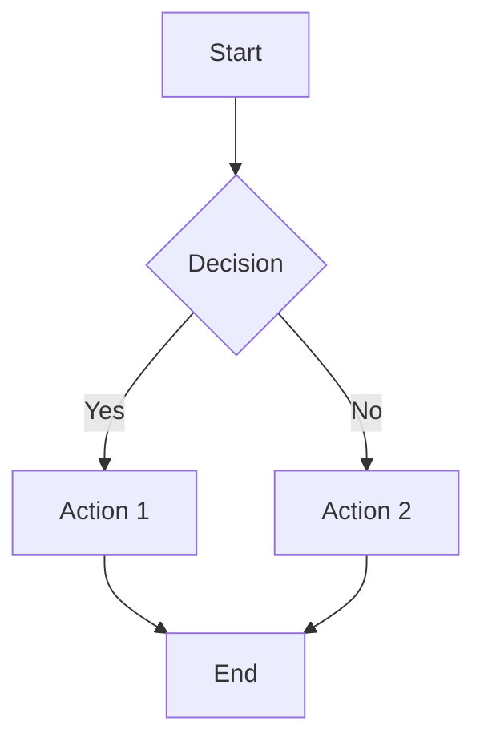

# Getting Started with Obsidian for Documentation

*The complete guide for non-technical users to create amazing documentation*

## Why Obsidian for Documentation?

Obsidian is perfect for creating documentation because it combines the simplicity of writing with powerful features that make your content shine. Here's why it's ideal:

### ✅ Perfect for Non-Technical Users
- **Simple writing**: Just type in plain text - no coding required
- **Live preview**: See your formatted content as you write
- **Visual editing**: WYSIWYG editing when you need it
- **No learning curve**: If you can use a word processor, you can use Obsidian

### ✅ Powerful Documentation Features
- **Linking content**: Connect related documents easily
- **File organization**: Drag-and-drop folder management
- **Search everything**: Find any content instantly
- **Templates**: Reuse document structures
- **Export options**: Share content in multiple formats

### ✅ Perfect Integration
- **Markdown output**: Works seamlessly with Hugo
- **File sync**: Automatically syncs with your documentation system
- **Version control**: Track changes and collaborate safely
- **No vendor lock-in**: Your files are always accessible

## Installation & Setup

### Step 1: Download and Install Obsidian

1. **Visit**: [obsidian.md](https://obsidian.md)
2. **Download** the version for your operating system:
   - Windows: Click "Download for Windows"
   - Mac: Click "Download for Mac"  
   - Linux: Click "Download for Linux"
3. **Install** by running the downloaded file
4. **Launch** Obsidian from your applications

### Step 2: Connect to Your Documentation Folder

When Obsidian first opens, you'll need to point it to your documentation content:

1. **Click "Open folder as vault"**
2. **Navigate to your documentation folder**:
   - If you installed via our script: `~/hugo-quarto-docs/content`
   - If you have a custom location: navigate to your `content` folder
3. **Select the content folder** and click "Open"
4. **Trust the vault** when prompted (this is safe)

### Step 3: Initial Configuration

#### Essential Settings
1. **Open Settings** (gear icon in bottom left)
2. **Go to "Files & Links"** section
3. **Configure these settings**:
   - **New link format**: Relative path to file
   - **Use [[Wikilinks]]**: Turn OFF (we use standard markdown links)
   - **Automatically update internal links**: Turn ON
   - **Default location for new attachments**: subfolder "assets"

#### Editor Preferences
1. **Go to "Editor"** section
2. **Recommended settings**:
   - **Show line numbers**: Turn ON (helpful for long documents)
   - **Word wrap**: Turn ON (easier reading)
   - **Show frontmatter**: Turn ON (see document metadata)
   - **Vim key bindings**: Leave OFF (unless you're familiar with Vim)

## Understanding Your Documentation Structure

### Folder Organization

Your documentation follows this structure:
```
content/
├── private/           # Personal documents
├── projects/          # Project documentation  
├── shared/           # Team knowledge base
└── assets/           # Images, files, exports
```

#### Private Folder
- **Purpose**: Your personal notes and documents
- **Examples**: Meeting notes, personal research, draft ideas
- **Visibility**: Only you can see these (not shared with team)

#### Projects Folder  
- **Purpose**: Specific project documentation
- **Structure**: One subfolder per project
- **Examples**: Client projects, internal initiatives, product development

#### Shared Folder
- **Purpose**: Knowledge that benefits the whole team
- **Examples**: Procedures, guidelines, reference materials, tutorials

### File Types You'll Work With

#### Markdown Files (.md)
- **Purpose**: Standard documentation and notes
- **Best for**: Meeting notes, procedures, reference guides
- **Features**: Fast, simple, web-only viewing

#### Quarto Files (.qmd)  
- **Purpose**: Rich documents with export capabilities
- **Best for**: Client deliverables, presentations, formal reports
- **Features**: Export to DOCX, PPTX, PDF formats

## Creating Your First Document

### Starting a New Document

1. **Right-click** in the file explorer (left sidebar)
2. **Choose "New file"**
3. **Name your file** with `.md` extension
   - Example: `meeting-notes-2025-01-21.md`
   - Example: `project-overview.md`

### Document Front Matter

Every document should start with "front matter" - metadata that helps organize your content:

```yaml
---
title: "Your Document Title"
description: "Brief description of the document"
date: 2025-01-21
---
```

**Copy this template and modify**:
- **title**: The main heading for your document
- **description**: What this document is about (helps with search)
- **date**: When you created or last updated it

### Basic Markdown Syntax

#### Headings
```markdown
# Main Heading (H1)
## Section Heading (H2)  
### Subsection Heading (H3)
#### Detail Heading (H4)
```

#### Text Formatting
```markdown
**Bold text** or __Bold text__
*Italic text* or _Italic text_
~~Strikethrough text~~
`Code or technical terms`
```

#### Lists
```markdown
Unordered list:
- First item
- Second item
- Third item

Ordered list:
1. First step
2. Second step
3. Third step
```

#### Links
```markdown
[Link text](https://example.com)
[Link to another document](./other-document/)
```

## Working with Projects

### Creating a New Project

1. **Right-click** on the "projects" folder
2. **Choose "New folder"**
3. **Name your project** (use lowercase with hyphens):
   - Example: `website-redesign`
   - Example: `product-launch-q2`
4. **Create an index file** inside the project folder:
   - Name it `_index.md`
   - This becomes the project homepage

### Project Index Template

Copy this template for new projects:

```yaml
---
title: "Project Name"
description: "Brief project description"
date: 2025-01-21
client: "Client Name (if applicable)"
team: ["Team Member 1", "Team Member 2"]
status: "Planning" # Planning, In Progress, Complete
start_date: "2025-01-21"
target_completion: "2025-03-15"
---

# Project Name

## Project Overview
Brief description of what this project is about and why it matters.

## Objectives
- Primary goal
- Secondary goal  
- Success criteria

## Team Members
- **Name** - Role and responsibilities
- **Name** - Role and responsibilities

## Project Documents
- [Project Proposal](./project-proposal/) (exports to DOCX/PPTX)
- [Meeting Notes](./meeting-notes/)
- [Progress Reports](./progress-reports/)

## Current Status
Brief update on where the project stands right now.
```

### Organizing Project Documents

**Typical project structure**:
```
project-name/
├── _index.md              # Project overview
├── project-proposal.qmd   # Formal proposal (exports)
├── meeting-notes.md       # All meeting notes
├── progress-reports.md    # Weekly/monthly updates
├── final-report.qmd       # Project completion (exports)
└── assets/               # Project-specific files
```

## Using Templates for Efficiency

### Creating Templates

1. **Create a "templates" folder** in your content directory
2. **Create template files** for common document types:
   - `meeting-notes-template.md`
   - `project-template.md`
   - `weekly-report-template.md`

### Sample Meeting Notes Template

```yaml
---
title: "Meeting Notes - [Date]"
description: "Notes from [meeting purpose]"
date: 2025-01-21
attendees: ["Name 1", "Name 2", "Name 3"]
meeting_type: "Planning" # Planning, Review, Update, etc.
---

# Meeting Notes - [Date]

**Meeting**: [Purpose/Subject]  
**Date**: [Date and Time]  
**Duration**: [Length]  
**Attendees**: [List attendees]

## Agenda
- Item 1
- Item 2
- Item 3

## Discussion Points

### Topic 1
Summary of discussion and key points raised.

### Topic 2  
Summary of discussion and key points raised.

## Decisions Made
1. Decision 1 with rationale
2. Decision 2 with rationale

## Action Items
- [ ] Task 1 - Owner - Due Date
- [ ] Task 2 - Owner - Due Date
- [ ] Task 3 - Owner - Due Date

## Next Steps
What happens after this meeting.

## Next Meeting
When and what will be discussed next.
```

### Using Templates

1. **Copy the template file**
2. **Rename it** for your specific use
3. **Fill in the brackets** with actual information
4. **Delete placeholder text** and add your content

## Advanced Features for Power Users

### Linking Documents

#### Internal Links
```markdown
See our [project proposal](../projects/website-redesign/project-proposal/) for more details.

Reference the [style guide](./style-guide/) when writing.
```

#### Creating Table of Contents
Obsidian can automatically generate TOCs:
```markdown
## Table of Contents
- [Section 1](#section-1)
- [Section 2](#section-2)
- [Section 3](#section-3)
```

### Using Comments for Collaboration

Add comments to your documents for team collaboration:
```markdown

Should we include pricing information in this section?

```

**Comment types**:
- `question` - Ask for input or clarification
- `suggestion` - Propose changes or improvements  
- `note` - Add context or explanation
- `action` - Mark items that need action

### Creating Rich Content

#### Tables
```markdown
| Column 1 | Column 2 | Column 3 |
|----------|----------|----------|
| Data 1   | Data 2   | Data 3   |
| Data 4   | Data 5   | Data 6   |
```

#### Code Blocks
```markdown
```javascript
function hello() {
    console.log("Hello, world!");
}
```
```

#### Callout Boxes
```markdown
> **💡 Pro Tip**  
> This is a helpful tip or important information.

> **⚠️ Warning**  
> This is something to be careful about.

> **📝 Note**  
> This is additional context or explanation.
```

## Quarto Documents for Exports

### When to Use Quarto (.qmd)

Use Quarto documents when you need:
- **Client deliverables** that need to be shared as DOCX or PPTX
- **Formal reports** with professional formatting
- **Presentations** that export to PowerPoint
- **Documents with complex formatting** like charts or diagrams

### Creating a Quarto Document

1. **Create a new file** with `.qmd` extension
2. **Add front matter** specifying export formats:

```yaml
---
title: "Document Title"
description: "Document description"
date: 2025-01-21
quarto_exports: ["docx", "pptx"]  # Formats to export
---
```

### Export Format Options
- `"docx"` - Microsoft Word document
- `"pptx"` - PowerPoint presentation
- `"pdf"` - PDF document (requires additional setup)

### Quarto Content Features

#### Diagrams with Mermaid
```markdown

```

#### Professional Tables
```markdown
| Phase | Duration | Deliverables | Status |
|-------|----------|--------------|--------|
| Research | 2 weeks | User interviews, analysis | Complete |
| Design | 2 weeks | Wireframes, mockups | In Progress |
| Development | 3 weeks | Working website | Pending |
```

## Tips for Great Documentation

### Writing Best Practices

#### Clear Headings
- **Use descriptive headings** that explain what's in each section
- **Follow hierarchy**: H1 → H2 → H3, don't skip levels
- **Keep consistent** formatting throughout documents

#### Scannable Content
- **Use bullet points** for lists and key information
- **Bold important terms** on first use
- **Break up long paragraphs** into smaller chunks
- **Add white space** between sections

#### Actionable Information
- **Be specific** about next steps and responsibilities
- **Include dates** and deadlines where relevant
- **Use active voice** ("We will create..." not "It will be created...")
- **Provide context** for decisions and recommendations

### Organization Strategies

#### Consistent Naming
```
Good examples:
- meeting-notes-2025-01-21.md
- project-proposal-website-redesign.qmd
- weekly-report-2025-week-03.md

Avoid:
- notes.md
- stuff.md  
- document1.md
```

#### Logical Structure
- **Group related documents** in the same folder
- **Use _index.md** files for folder overviews
- **Create clear hierarchies** that match how you think
- **Archive old projects** to keep current work visible

### Collaboration Tips

#### Team Communication
- **Use comments** to ask questions or provide feedback
- **Be specific** in your questions and suggestions
- **Respond promptly** to comments from team members
- **Keep discussions** in context near relevant content

#### Version Control
- **Save frequently** (Obsidian auto-saves, but good practice)
- **Use descriptive titles** that indicate content changes
- **Keep important versions** by duplicating before major changes
- **Communicate changes** that affect others' work

## Troubleshooting Common Issues

### Obsidian Won't Open My Vault
**Solution**: 
1. Check that you're opening the correct folder (should be the `content` folder)
2. Make sure the folder path doesn't have special characters
3. Try "Open another vault" and select the folder again

### Links Not Working
**Solution**:
1. Check file paths are correct relative to current document
2. Ensure linked files actually exist
3. Use `.md` extension in link paths
4. Verify folder structure matches your links

### Images Not Showing
**Solution**:
1. Place images in an `assets` folder within the same directory
2. Use relative paths: ``
3. Ensure image file names don't have spaces (use hyphens instead)
4. Check image file extensions are correct (.jpg, .png, .gif, etc.)

### Export Not Working (Quarto)
**Solution**:
1. Ensure you're using `.qmd` extension (not `.md`)
2. Check `quarto_exports` in front matter is correct
3. Run the build script: `./build.sh` 
4. Look for exported files in the website's static folder

## Getting Help

### Built-in Help
- **Obsidian Help**: Press `Ctrl/Cmd + ,` then click "Help"
- **Command Palette**: Press `Ctrl/Cmd + P` for quick access to features
- **Markdown Guide**: Built into Obsidian's help documentation

### Online Resources
- **Obsidian Forum**: [forum.obsidian.md](https://forum.obsidian.md)
- **Obsidian Help**: [help.obsidian.md](https://help.obsidian.md)
- **Markdown Guide**: [markdownguide.org](https://markdownguide.org)

### Team Support
- Ask team members who are already using the system
- Check existing documentation in the `shared` folder
- Look at example projects for formatting ideas
- Use comments in documents to ask for help with specific content

---

## Quick Start Checklist

### ✅ Setup (One-time)
- [ ] Download and install Obsidian
- [ ] Open your content folder as a vault
- [ ] Configure basic settings (links, attachments)
- [ ] Create your templates folder

### ✅ Daily Usage
- [ ] Open Obsidian and navigate to your content
- [ ] Create new documents with proper front matter
- [ ] Use clear headings and formatting
- [ ] Link related documents together  
- [ ] Save and sync your work

### ✅ Weekly Habits
- [ ] Review and organize your documents
- [ ] Update project status in index files
- [ ] Clean up old drafts and temporary files
- [ ] Export any Quarto documents that need sharing

---

💡 **Remember**: The goal is to make documentation easy and natural. Start simple with basic markdown, then gradually use more advanced features as you get comfortable.

**Happy documenting!** 📝